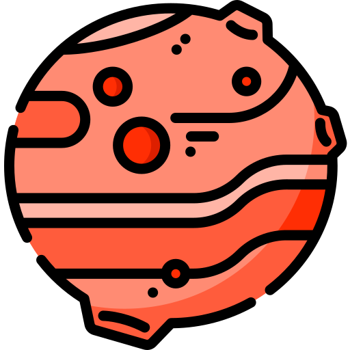

# Projeto FROGGER em MIPS Assembly - Arquitetura de Computadores

Bem-vindo ao Projeto FROGGER, uma implementação clássica do famoso jogo Frogger em linguagem Assembly MIPS, desenvolvido como projeto final para a disciplina de Arquitetura de Computadores.

## Como Jogar

1. **Objetivo:** Leve o sapo até o topo da tela, cruzando a movimentada pista de carros e a perigosa correnteza, repetindo este processo 3 vezes para vencer o jogo.

2. **Controles:**

   - Utilize as teclas `W` para mover o sapo para cima.
   - Utilize as teclas `A` para mover o sapo para a esquerda.
   - Utilize as teclas `S` para mover o sapo para baixo.
   - Utilize as teclas `D` para mover o sapo para a direita.
   - Utilize as teclas `R` para resetar o jogo caso ganha ou perca. 
   - Utilize as teclas `P` para finalizar o jogo caso ganha ou perca. 


3. **Perigos:**
   - Colisão com carros: Se o sapo colidir com um carro, ele perderá uma vida.
   - Queda na água: Se o sapo cair na água, também perderá uma vida.
   - Vidas: O jogador começa com 3 vidas. Perca todas as vidas e o jogo será encerrado.

4. **Vitória:**
   - O jogador ganha o jogo ao levar o sapo até o topo da tela 3 vezes sem perder todas as vidas.

## Como Executar o Jogo

1. Certifique-se de ter um ambiente MIPS Assembly configurado.

2. Clone o repositório:
   ```bash
   git clone https://github.com/seu-usuario/projeto-frogger-mips
   ```

3. Navegue até o diretório do projeto:
   ```bash
   cd projeto-frogger-mips
   ```

4. Compile e execute o jogo usando seu ambiente MIPS:
   - O simulador utilizado no projeto foi o **MARS45**
   - Link para download: https://drive.google.com/file/d/1tZY_4bk8qcmD8GYL9o2Lj2QPOxv4_bv5/view?usp=sharing 



5. Divirta-se jogando Frogger em MIPS Assembly!

## Contribuições

Contribuições são bem-vindas! Sinta-se à vontade para abrir problemas (issues) ou enviar pull requests para melhorar este projeto.

## Créditos

Este projeto foi desenvolvido por Livia Vitória da Silva como parte do projeto final da disciplina de Arquitetura de Computadores.

Divirta-se jogando! 🐸🚗💦